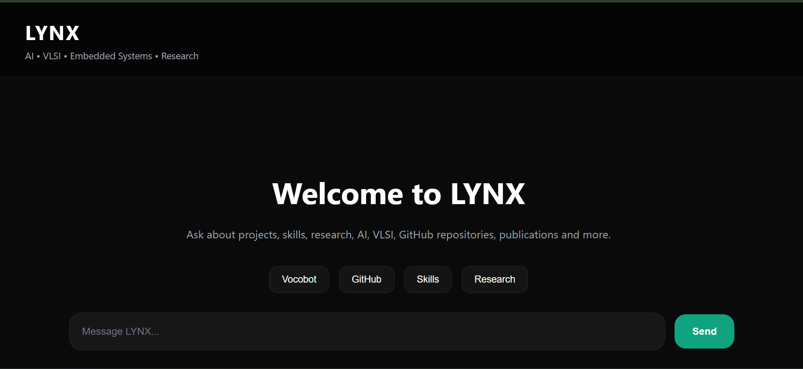
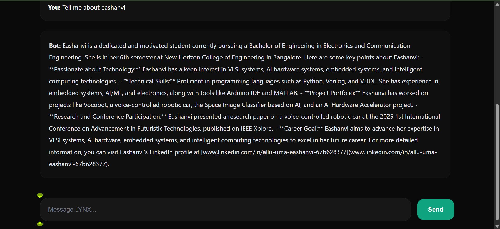

# LYNX — AI Portfolio Assistant 🚀

LYNX is an AI-powered interactive portfolio assistant developed for showcasing projects, technical skills, research interests, publications, and GitHub repositories in a conversational interface.

The chatbot acts like a futuristic AI recruiter assistant capable of answering questions about Eashanvi’s profile, projects, skills, VLSI interests, AI systems, embedded systems, and more.

 Live Demo: https://lynx-ai-portfolio-assistant-n50e758st-eashanvi-s-projects.vercel.app

---

## ✨ Features

- 💬 Interactive AI chatbot

- 🧠 Conversational memory

- 🤖 Jarvis-inspired assistant behavior

- 📁 GitHub project recommendations

- 🔗 Repository link sharing

- 🎯 Skills \& proficiency explanation

- 📚 Research \& publication information

- 🌌 Modern futuristic UI

- ⚡ Fast Node.js backend

---

## 🛠️ Tech Stack

### Frontend

- HTML

- CSS

- JavaScript

### Backend

- Node.js

- Express.js

### APIs

- OpenRouter API

- OpenAI GPT Models

---

## 📸 Screenshots

### Homepage UI

---

### Chat Interface

\---

## 👩‍💻 About

*\*Allu Uma Eashanvi\*\*  

GitHub:

https://github.com/Eashanvi

---

## 🚀 Future Improvements

- Voice interaction

- Speech synthesis

- Animated AI avatar

- Resume download

- Multi-language support

- AI memory expansion

- Deployment with authentication

---

